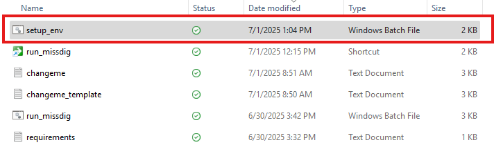
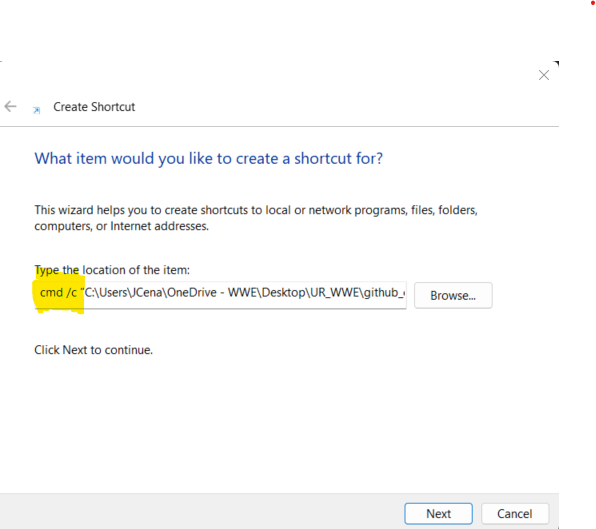
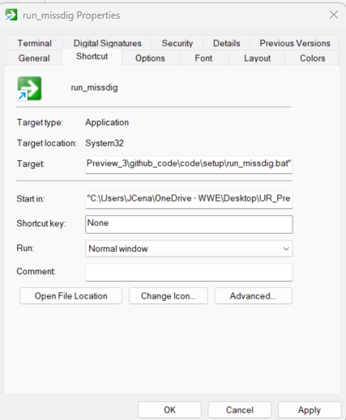
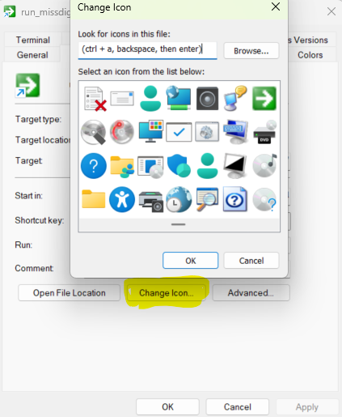
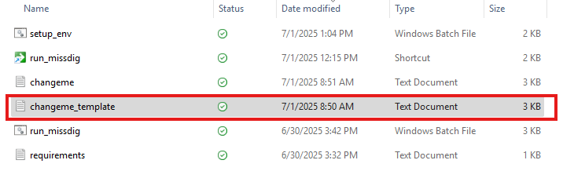
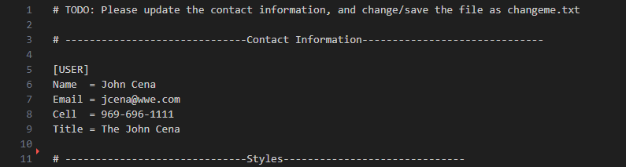
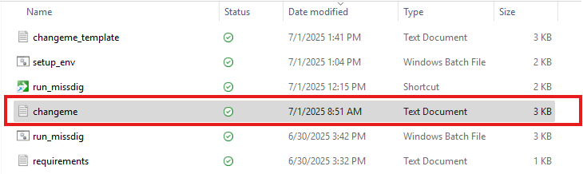
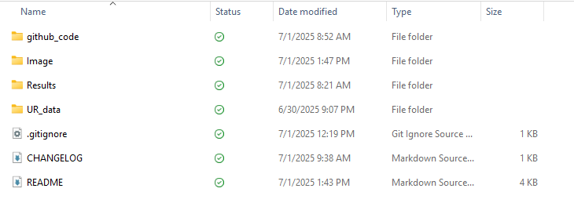
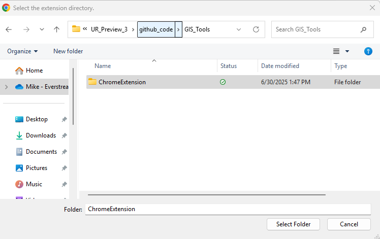
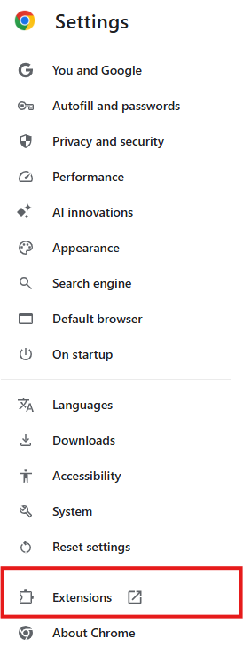

<p align="center">
  
  <h1>Utility Review <span style="font-size: 0.75em; font-weight: normal;">(preview 3)</span></h1>
</p>

<header>edited on July 1, 2025</header>

# 🔁 Workflow


```plaintext
Project Structure (July 1, 2025)

UR_Preview_3/
├── UR_data/
│   └── ShapeFiles/              # Stores input shapefiles (not tracked by Git, from Teams)
├── github_code/
│   ├── code/
│   │   ├── .venv/               # Virtual environment (ignored by Git)
│   │   ├── main.py              # Main entry point for the script
│   │   ├── parsers/             # Parsing utilities for GML and TXT
│   │   │   ├── gml_parser.py
│   │   │   ├── txt_parser.py
│   │   │   └── __init__.py
│   │   ├── processing/          # Processing logic (clipping, mapping, email)
│   │   │   ├── clipping.py
│   │   │   ├── mapping.py
│   │   │   ├── emailer.py
│   │   │   ├── screenshot.py
│   │   │   └── __init__.py
│   │   ├── setup/               # Config, launchers, and setup tools
│   │   │   ├── changeme.txt           # Active config file (created from template)
│   │   │   ├── changeme-template.txt # Template config (reference)
│   │   │   ├── requirements.txt      # Python dependencies
│   │   │   ├── run_missdig.bat       # Batch script to run project
│   │   │   ├── run_missdig.lnk       # Windows shortcut (ignored by Git)
│   │   │   └── setup_env.bat         # Batch script to set up the environment
│   │   ├── utils/               # Utility functions
│   │   │   ├── changeme.py      # Logic for loading and parsing changeme.txt
│   │   │   └── __init__.py
├── GIS_Tools/ChromeExtension/   # (Extension for Salesforce Scraping)
├── Results/                     # Output results (ignored by Git, created by Scripts if not exist)
├── Image/                       # Images folder
├── .gitignore                   # Git ignore rules
└── README.md                    # Project overview and instructions
```


# 🔧 Initial Setup Guide – Utility Review

## 📁 1. Prepare the Project Folder
1. Download and extract the `UR_Preview` folder to your **Desktop**.
2. Open the folder in **File Explorer**.

---

## ⚙️ 2. Set Up the Python Environment
1. Navigate to:  
   `UR_Preview_3/github_code/code/setup`
2. Double-click `setup_env.bat`  
   This will:
   - Create and activate a Python virtual environment
   - Upgrade `pip`
   - Install required dependencies from `requirements.txt`  
   
📷 _Example:_  


---

## 🔗 3. Create a Shortcut for `run_missdig.bat`
1. In the same `setup` folder:
   - Right-click on blank space → **New → Shortcut**
   - In the location field, type:  
     ```
     cmd /c 
     ```
   - Right-click `run_missdig.bat` → **Copy as path**
   - Paste the copied path after `cmd /c`
2. Name the shortcut (e.g., `Run MissDig`)
3. Right-click the shortcut → **Properties**
4. Set the **Start in** field to the folder path (copy it from the address bar)
5. *(Optional)* Click **Change Icon**, clear the path, hit Enter, and select an icon you like
6. Click **Apply**
7. Drag the shortcut to your **taskbar** to pin it

📷 _Example images:_  
  
  


---

## 📝 4. Customize Your Contact Info
1. Open:  
   `UR_Preview_3/github_code/code/setup/changeme_template.txt`
2. Edit the `[USER]` section with your:
   - Name
   - Email
   - Phone number

📷 _Before and After:_  
  


3. Save the file as:  
   `changeme.txt`

📷 _Example:_  


---

## 📦 5. Download and Extract Project Data
1. Go to Teams OneDrive → `GIS Specialist` → `Document` → `General` → `Mike Stuff`
2. Download `UR_data.zip`
3. Extract its contents into the root of the `UR_Preview_3` folder

📷 _Folder Structure:_  


---

# 🌐 Initial Setup – Salesforce Scraper Extension

## 1. Load the Chrome Extension
1. Open **Google Chrome**
2. Go to `chrome://extensions`
3. Enable **Developer mode** (top-right corner)
4. Click **Load Unpacked**
5. Select the folder:  
   `UR_Preview_3/github_code/GIS_Tools/ChromeExtension`
6. The UR Extractor extension should now be loaded

📷 _Chrome View:_  


## 2. Pin the Extension to Toolbar
1. Click **Details** on the extension
2. Enable **Pin to toolbar**

📷 _Extension Settings:_  


---

✅ You're now fully set up to run the Utility Review scripts and extract Salesforce tickets.